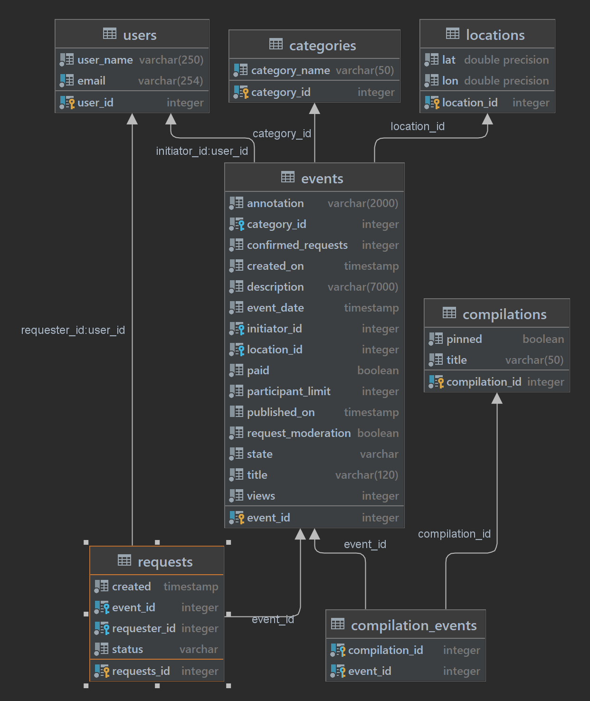

# java-explore-with-me
Учебный проект, для применения java 11, Maven, Spring BOOT, RestTemplate, JpaRepository, PostgreSQL, Docker.
# Описание
Приложение - электронная афиша мероприятий. Позволяет пользователям делиться информацией об интересных событиях и находить компанию для участия в них.
Реализована микросервисная архитектура.
- Service - обработка запросов к приложению.
- Stats - хранения статистики запросов по эндпоинтам.

Эндпоинты
---
- GET /compilations - Получение подборок событий
- GET /compilations/{compId} - Получение подборки событий по его id
---
- POST /admin/categories Добавление новой категории
- DELETE /admin/categories/{catId} Удаление категории
- GET /admin/categories/{catId} Получение списка бронирований для всех вещей текущего пользователя.
---
- GET /users/{userId}/events - Получение событий, добавленных текущим пользователем
- POST /users/{userId}/events - Добавление нового события
- GET /users/{userId}/events/{eventId} - Получение полной информации о событии добавленном текущим пользователем
- PATCH /users/{userId}/events/{eventId} - Изменение события добавленного текущим пользователем
- GET /users/{userId}/events/{eventId}/requests - Получение информации о запросах на участие в событии текущего пользователя
- PATCH /users/{userId}/events/{eventId}/requests - Изменение статуса (подтверждена, отменена) заявок на участие в событии текущего пользователя
---
- GET /categories - Получение категорий
- GET /categories/{catId} - Получение информации о категории по её идентификатору
---
- GET /admin/events - Поиск событий
- PATCH /admin/events/{eventId} - Редактирование данных события и его статуса (отклонение/публикация).
--- 
- GET /events/{id} - Получение подробной информации об опубликованном событии по его идентификатору
- GET /events/{id} - Получение подробной информации об опубликованном событии по его идентификатору
---
- GET /users/{userId}/requests - Получение информации о заявках текущего пользователя на участие в чужих событиях
- POST /users/{userId}/requests - Добавление запроса от текущего пользователя на участие в событии
- DELETE /users/{userId}/requests/{requestId}/cancel - Отмена своего запроса на участие в событии
---
- GET /admin/users - Получение информации о пользователях
- POST /admin/users - Добавление нового пользователя
- DELETE /admin/users/{userId} - Удаление пользователя
---
- POST /admin/compilations - Добавление новой подборки (подборка может не содержать событий)
- DELETE /admin/compilations/{compId} - Удаление подборки
- PATCH /admin/compilations/{compId} - Обновить информацию о подборке
---
- GET /stats - Получение статистики по посещениям
- POST /hit - Сохранение информации о том, что на uri конкретного сервиса был отправлен запрос пользователем.
---
- DELETE /comments/{commentId} - удаление комменатрия администратором
- POST /users/{userId}/events/{eventId}/comments - добавление комментария пользователем событию
- PATCH /users/{userId}/events/{eventId}/comments - редактирование пользователем собственного комментария
- DELETE /users/{userId}/events/{eventId}/comments/{commentId} - удаление комментария пользователем
- GET /comments - получение пользователем списка собственных комментариев
- GET /events/{eventId}/comments/{commentId} - получение комментария по его id
- GET /events/{eventId}/comments - получение списка комментариев события
---
Схема базы данных сервиса

